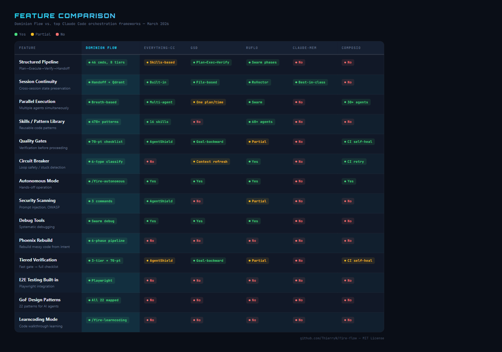
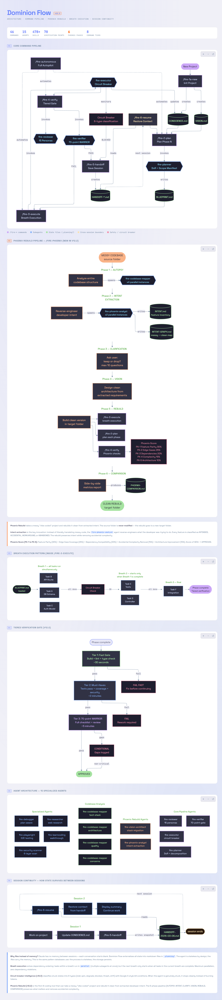

# Dominion Flow (Fire Flow) v12.2

**The most comprehensive orchestration platform for Claude Code.**

Dominion Flow gives Claude a complete, structured way to take your project from idea to finished code — with built-in quality checks, session memory, parallel execution, and a library of 478+ proven patterns. Think of it as a project management system that lives inside Claude Code.

---

## NEW in v12.2: Phoenix Rebuild

**Every AI coding tool creates code. Dominion Flow is the first that can take a messy "vibe coded" project and rebuild it clean.**

```bash
/fire-phoenix --source ./my-messy-app
```

Phoenix reverse-engineers what your code was *trying* to do, asks you clarifying questions, then rebuilds the entire project from scratch in a new folder — production-ready, properly architected, fully tested.

**6-phase autonomous pipeline:**
```
AUTOPSY → INTENT → CLARIFY → VISION → REBUILD → COMPARISON
```

- Extracts developer INTENT from messy code (not just what it does, but what it was *trying* to do)
- Classifies every feature: intended, accidental, workaround, or abandoned
- Maps anti-patterns to clean replacements (12 common vibe-coder patterns)
- Preserves edge cases and business rules (the important stuff)
- Source folder is never modified — rebuild goes to a new target folder
- Phoenix Score (PX-1 to PX-5) verifies feature parity, edge case coverage, and architecture improvement

**Dry-run mode** analyzes without rebuilding — useful for auditing any codebase:
```bash
/fire-phoenix --source ./app --dry-run
```

---

## What Does It Do?

When you start a new project, Claude normally has no memory between sessions, no standard process, and no way to verify its own work. Dominion Flow fixes all of that:

- **Structured workflow** — A numbered pipeline (Plan → Execute → Verify → Handoff) so nothing gets skipped
- **Session memory** — Claude picks up exactly where it left off, every time
- **Parallel execution** — Multiple tasks run at the same time, safely, so work gets done faster
- **Built-in quality gates** — 70-point verification checklist with tiered gates (fast → must-haves → comprehensive)
- **Skills library** — 478+ proven code patterns Claude can reuse instead of reinventing every time
- **Phoenix Rebuild** — Take any messy codebase and rebuild it clean from extracted intent
- **Research-backed methodology** — Circuit breaker intelligence, kill conditions, stuck-state classification, and more

---

## Who Is This For?

This plugin is for anyone using Claude Code who wants:
- Consistent, repeatable results on complex projects
- Claude to remember what it was doing between sessions
- Code that gets reviewed and verified, not just written
- A messy "vibe coded" project cleaned up and rebuilt properly

**No prior experience with orchestration or AI agents required.**

---

## Quick Install

One command does it all:

```bash
npx @thierrynakoa/fire-flow
```

Or clone the repository manually:

```bash
git clone https://github.com/ThierryN/fire-flow.git
claude install-plugin ./fire-flow
```

For advanced users, the repository also supports optional "Power Features" like Docker-integrated memory (Qdrant) and local embeddings (Ollama) to make the agent even more powerful.


---

## Quick Install

**Prerequisite:** You need [Claude Code](https://claude.ai/download) installed first. If you don't have it yet, download and install it, then come back here.

### Method A — One Command (Recommended)

```bash
npx @thierrynakoa/fire-flow
```

That's it. The installer copies everything to `~/.claude/plugins/fire-flow/` automatically.

To update later:
```bash
npx @thierrynakoa/fire-flow --update
```

To uninstall:
```bash
npx @thierrynakoa/fire-flow --uninstall
```

---

### Method B — Git Clone

1. Open your terminal and clone the repo:
   ```bash
   git clone https://github.com/ThierryN/fire-flow.git
   ```

2. Install the plugin from the cloned folder:
   ```bash
   claude install-plugin ./fire-flow
   ```

3. Restart Claude Code

4. Type `/fire-0-orient` to check that everything is working

---

### Method C — Download ZIP (No Git or npm Required)

1. Go to [github.com/ThierryN/fire-flow](https://github.com/ThierryN/fire-flow)
2. Click the green **"Code"** button → **"Download ZIP"**
3. Extract the ZIP file to a folder you will keep (e.g., `Documents/fire-flow`)
4. Open your terminal and install the plugin from that folder:

   **Mac / Linux:**
   ```bash
   claude install-plugin ~/Documents/fire-flow
   ```

   **Windows:**
   ```bash
   claude install-plugin C:\Users\YourName\Documents\fire-flow
   ```
   *(Replace `YourName` with your actual Windows username)*

5. Restart Claude Code

6. Type `/fire-0-orient` to check that everything is working

---

## Slash Commands Not Appearing?

If you've installed Dominion Flow but the `/fire-` commands don't show up when you type `/` in Claude Code, follow these steps:

### Option A — Ask Claude to Fix It (Easiest)

Open Claude Code and paste this message:

> *"My Dominion Flow plugin is installed but the /fire- slash commands aren't appearing. Please check my ~/.claude/settings.json, register the plugin under enabledPlugins, and refresh my commands."*

Claude will inspect your configuration, add the missing plugin entry, and reload the commands automatically.

### Option B — Fix settings.json Manually

1. Open your global Claude Code settings file:

   **Mac / Linux:**
   ```bash
   code ~/.claude/settings.json
   ```

   **Windows:**
   ```bash
   code %USERPROFILE%\.claude\settings.json
   ```

   *(Replace `code` with `notepad`, `nano`, or any text editor you prefer)*

2. Find the `"enabledPlugins"` section. If it doesn't exist, add it. Then add the Dominion Flow entry:

   ```json
   {
     "enabledPlugins": {
       "dominion-flow@local": true
     }
   }
   ```

   If you already have other plugins listed, just add the `"dominion-flow@local": true` line inside the existing block (don't forget the comma on the line above it).

3. Save the file and **restart Claude Code completely** (close and reopen — not just a new conversation).

4. Type `/fire-0-orient` to confirm the commands are working.

### Option C — Reinstall the Plugin

If the above steps don't work, reinstall from scratch:

```bash
npx @thierrynakoa/fire-flow --update
```

Or if you cloned from GitHub:

```bash
claude plugin uninstall dominion-flow
claude install-plugin ./fire-flow
```

Then restart Claude Code.

### Still Not Working?

See [TROUBLESHOOTING.md](./TROUBLESHOOTING.md) for additional diagnostics, or open an issue at [github.com/ThierryN/fire-flow/issues](https://github.com/ThierryN/fire-flow/issues).

---

## Optional but Recommended: Power Features

The core workflow works out of the box. These extras unlock **persistent memory**, **codebase search**, and **Docker Hub access** — features that make Claude dramatically more capable on larger projects.

---

### Step 1 — Install Docker Desktop

Docker Desktop is required to run Qdrant. Install it before anything else.

**Windows (PC):**

1. Go to [docker.com/products/docker-desktop](https://www.docker.com/products/docker-desktop/) and click **Download for Windows**
2. Before running the installer, open **PowerShell as Administrator** and run:
   ```powershell
   wsl --update
   wsl --set-default-version 2
   ```
3. Restart your computer
4. Run the Docker installer and choose **"Use WSL 2 instead of Hyper-V"** when prompted
5. After install, open Docker Desktop from your Start menu and wait for it to fully start (the whale icon in your taskbar stops animating)
6. Verify it worked:
   ```bash
   docker --version
   ```

**Mac:**

1. Go to [docker.com/products/docker-desktop](https://www.docker.com/products/docker-desktop/) and click **Download for Mac**
   - Choose **Apple Chip** if you have an M1/M2/M3/M4 Mac, or **Intel Chip** for older Macs
   - Not sure which? Click Apple menu → **About This Mac**
2. Open the `.dmg` file and drag Docker to your Applications folder
3. Open Docker from Applications and follow the prompts
4. Wait for it to fully start (whale icon in menu bar stops animating)
5. Verify it worked:
   ```bash
   docker --version
   ```

> Docker Desktop must be **open and running** whenever you use Qdrant or hub-mcp.

---

### Step 2 — Run Qdrant (Vector Database)

Qdrant stores Claude's persistent memory across sessions — so Claude remembers your codebase, past decisions, and patterns from previous work.

```bash
docker pull qdrant/qdrant
```

```bash
docker run -d \
  -p 6333:6333 \
  -p 6334:6334 \
  -v qdrant_storage:/qdrant/storage \
  --name qdrant \
  qdrant/qdrant
```

| Port | What it is |
|------|-----------|
| **6333** | REST API — main port used by Claude |
| **6334** | gRPC — high-speed operations |

**Verify:** Open [http://localhost:6333/dashboard](http://localhost:6333/dashboard) in your browser. If you see the Qdrant dashboard, it is running.

---

### Step 3 — Connect Qdrant to Claude (MCP)

This is what allows Claude to read and write to your `power_flow_memory` database.

**Mac or WSL:**
```bash
claude mcp add qdrant -s user -- uvx mcp-server-qdrant \
  --url http://localhost:6333 \
  --collection-name power_flow_memory
```

**Windows (CMD or PowerShell):**
```bash
claude mcp add qdrant -s user -- cmd /c uvx mcp-server-qdrant \
  --url http://localhost:6333 \
  --collection-name power_flow_memory
```

---

### Step 4 — Install Ollama (Local Embeddings)

Ollama runs locally and generates the vectors that get stored in Qdrant.

1. Download and install from [ollama.com](https://ollama.com)
2. Pull the embedding model:
   ```bash
   ollama pull nomic-embed-text
   ```

---

### Step 5 — Run Docker Hub MCP Server (hub-mcp)

hub-mcp lets Claude search Docker Hub, browse images and tags, and pull images by just asking.

```bash
docker pull docker/hub-mcp
```

```bash
docker run -d \
  -p 8080:8080 \
  --name hub-mcp \
  docker/hub-mcp
```

Connect to Claude Code:

```bash
claude mcp add hub-docker -s user --transport sse http://localhost:8080/sse
```

> If port 8080 is already in use on your machine, change the left port number (e.g., `-p 9090:8080`) and update the URL to match (e.g., `http://localhost:9090/sse`).

---

### Verify Everything Is Connected

Restart Claude Code, then type `/mcp`. You should see:

| Server | What it does |
|--------|-------------|
| `qdrant` | Claude ↔ `power_flow_memory` database |
| `hub-docker` | Claude ↔ Docker Hub image search |

Then ask Claude to confirm the database connection:

> *"Check if my Qdrant power_flow_memory collection is reachable and tell me how many points are stored."*

Claude will query Qdrant directly and confirm it is live.

---

## Your First Project (5 Minutes)

Start a new project with one command:

```bash
/fire-1a-new
```

Claude will ask you a few simple questions about your project, then set everything up automatically. After that, the numbered commands walk you through each step:

```
/fire-1a-new      → Start your project (asks you questions, creates the plan)
/fire-2-plan 1    → Plan the first phase of work
/fire-3-execute 1 → Build it (Claude does the coding)
/fire-4-verify 1  → Check that everything actually works
/fire-5-handoff   → Save your progress before closing
/fire-6-resume    → Pick up where you left off next session
```

**Want Claude to handle everything automatically?**
After `/fire-1a-new`, just run:
```bash
/fire-autonomous
```
Claude will plan, build, and verify every phase without you having to type each command.

**Have a messy existing project?** Rebuild it clean:
```bash
/fire-phoenix --source ./my-app
```

---

## How Does It Compare?



## Key Features

| Feature | What It Does |
|---------|-------------|
| 46 slash commands | Every task has a dedicated command — no guessing |
| 478+ skills library | Proven patterns for auth, payments, APIs, and more |
| Phoenix Rebuild | Reverse-engineer messy code intent, rebuild clean from scratch |
| Breath-based parallelism | Independent tasks run at the same time |
| Tiered verification | Fast gate → must-haves → 70-point WARRIOR checklist |
| Session handoffs | Claude remembers everything between sessions |
| Circuit breaker intelligence | 6-type stuck classification with kill conditions |
| Auto skill extraction | Useful patterns discovered during work get saved automatically |
| Playwright E2E testing | Automated browser testing built in |
| Learncoding mode | Walk through any codebase step-by-step to learn it |
| Security scanning | Detect prompt injection, OWASP vulnerabilities, credential leaks |
| GoF design patterns | All 22 patterns mapped to AI agent architecture |

---

## All 46 Commands

Commands are grouped into 8 tiers. You only need Tier 1 for most projects.

| Tier | Purpose | Key Commands |
|------|---------|-------------|
| 1 — Core Workflow | The main pipeline | `/fire-1a-new` through `/fire-6-resume` |
| 2 — Autonomous | Full autopilot + Phoenix Rebuild | `/fire-autonomous`, `/fire-phoenix`, `/fire-loop` |
| 3 — Debug & Discover | Investigate problems | `/fire-debug`, `/fire-map-codebase` |
| 4 — Verification | Quality gates | `/fire-7-review`, `/fire-verify-uat` |
| 5 — Skills | Manage the pattern library | `/fire-search`, `/fire-add-new-skill` |
| 6 — Analytics & PM | Track progress | `/fire-dashboard`, `/fire-todos` |
| 7 — Milestones | Long-term projects | `/fire-new-milestone`, `/fire-complete-milestone` |
| 8 — Advanced | Specialized tools | `/fire-cost`, `/fire-execute-plan` |

See [COMMAND-REFERENCE.md](./COMMAND-REFERENCE.md) for the complete list with descriptions.

---

## Finding More Skills

The skills library is what makes Dominion Flow powerful. Skills are reusable patterns that Claude draws on during your project — for auth, payments, APIs, database design, testing, and much more.

**Where to find skills:**

- [aitmpl.com/skills](https://www.aitmpl.com/skills) — Curated skill collections, ready to install
- [skillsmp.com](https://skillsmp.com/) — Community skill marketplace
- GitHub — Search for `claude-code-skills` or `dominion-flow-skills` to find repos shared by the community

**Installing skills from GitHub:**
```bash
claude plugin install <github-username>/<repo-name>
```

You can also create your own skills as you work. When Claude discovers a useful pattern, `/fire-add-new-skill` saves it to your library automatically.

---

## Documentation

| File | What It Covers |
|------|---------------|
| [QUICK-START.md](./QUICK-START.md) | Step-by-step walkthrough of your first project |
| [COMMAND-REFERENCE.md](./COMMAND-REFERENCE.md) | All 46 commands with descriptions |
| [references/warrior-principles.md](./references/warrior-principles.md) | The WARRIOR operating principles — what they are and why they matter |
| [DOMINION-FLOW-OVERVIEW.md](./DOMINION-FLOW-OVERVIEW.md) | Full system diagrams and architecture |
| [ARCHITECTURE-DIAGRAM.md](./ARCHITECTURE-DIAGRAM.md) | Visual overview of how everything connects |
| [TROUBLESHOOTING.md](./TROUBLESHOOTING.md) | Common problems and how to fix them |

---

## Community

Have questions, want to share what you built, or just want to connect with others learning Claude Code?

**Join the Facebook group:** [Claude Code Community](https://www.facebook.com/groups/1671431084311638)

This is where students and followers ask questions, share projects, and stay up to date.

---

## Support This Project

If you're following along and finding Dominion Flow useful, the best way to help is simple:

- **Star this repo** — it helps others discover it
- **Share it** — pass it along to anyone learning Claude Code or building AI-assisted projects

This is a living project. Your support keeps it growing.

---

## Architecture Diagram



View the full interactive version: **[Dominion Flow Architecture (HTML)](./docs/dominion-flow-architecture.html)** — Download and open in your browser to explore with interactive navigation.

---

## Privacy Policy

Dominion Flow runs entirely on your local machine. It does not:

- Collect, transmit, or store any personal data
- Send analytics or telemetry of any kind
- Connect to external servers (unless you optionally configure Qdrant or Ollama locally)
- Access any files outside your project directory and `~/.claude/plugins/`

All session memory, handoff files, and skills remain on your computer. The optional Qdrant vector database runs locally on your machine via Docker — no cloud services involved.

**In short: your code and data never leave your machine.**

---

## License

MIT License — Copyright (c) 2026 ThierryN

This software is free to use, copy, modify, and distribute. See [LICENSE](./LICENSE) for the full text.


